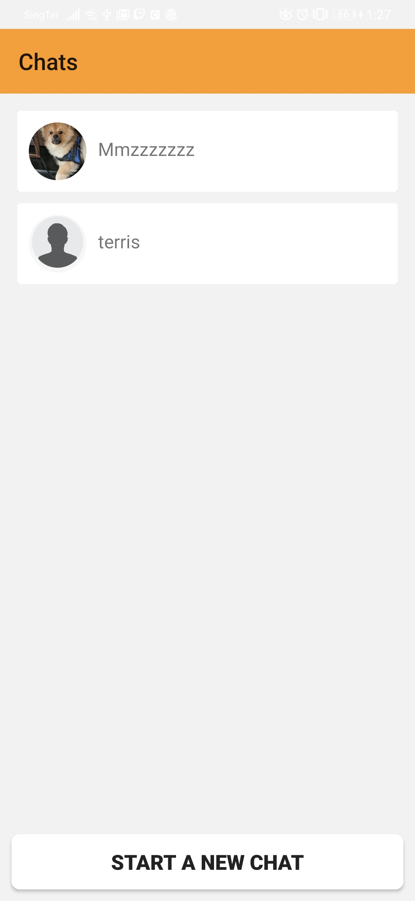
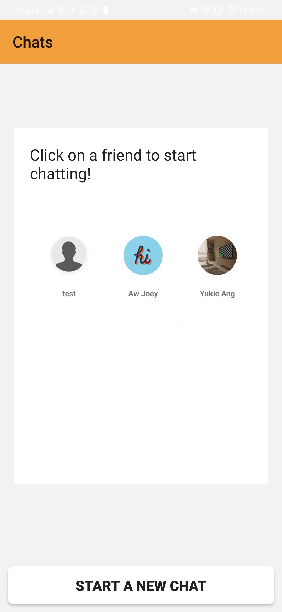
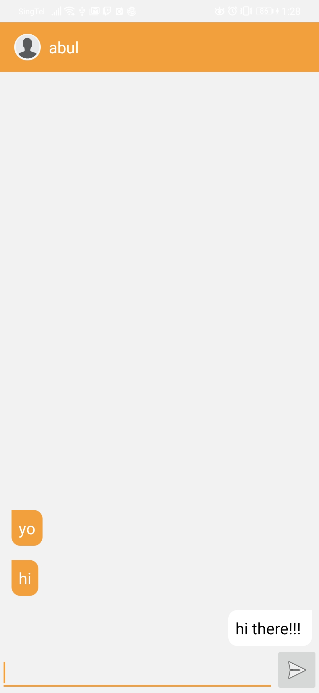
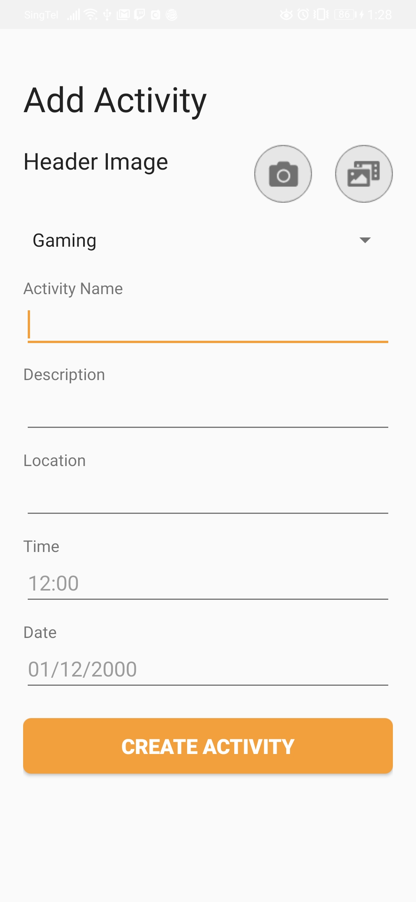

# Social.ly

Team members: Aw Joey(s10196528), Yukie Ang(s10195775), Terris Ng(s10197829), Tan Ming Zhe(S10193694)

## Roles and contribution:
Ming Zhe - Lead Developer
Joey - Lead Developer
Terris - Lead Designer
Yukie - Lead Developer

### Class file
Yukie: ExploreAdapter.java, ExploreFragment.java, DisplayActivities, DisplayActivitiesAdapter, DisplaySelectedActivity, Activity

MingZhe: Chat, Conversation, CreateActivity, GridFriendAdapter, Message, MessageAdapter, NewChat, Useradapter

Aw Joey: User, FriendsAdapter, FriendsFragment, FriendsViewModel

Terris: Register.java, Register2.Java, Login.Java, Start.Java

#### Layout file

Yukie: activity_display_selected.xml, create_activity.xml, display_activities.xml, fragment_explore.xml, activityitem.xml, interestitem.xml

MingZhe: Activity_conversation.xml, Activity_message, Activity_NewChat.xml, chat_left.xml, chat_right.xml,gridfrienditem.xml,useritem.xml

Aw Joey: fragment_home.xml, fragment_home_addfriend.xml, fragment_home_alert.xml

Terris: activity_login.xml, activity_register.xml, activity_register2.xml, toolbar.xml,topmenu.xml

## Relevant appendices

### Welcome Screen
This activity welcomes our users and shows them a welcome message along with a short description of what our app is about. This activity allows the user to register or login.

### Register (1/2)
This activity is the first out of two steps to registering in this app. This screen lets users to enter their name, email, password and birth date. The user is not allowed to proceed to the next step without putting in all the information

### Register (2/2)
This activity is the second out of two steps to registering in this app. This screen allows users to personalize their profile by uploading their profile image (either taking a picture or uploading an image from the gallery), their nickname, interest, and short description. Upon pressing register, the application uploads the information from the first and second screen to firebase and creates the profile and automatically logs them in.

### Toolbar
The toolbar replaces the default App bar to give us more customization on the design. This toolbar gives users the option to chat or log out of the app.

### Add Friend
This fragment displays many users, each in a card. Upon swiping the card, another user will be displayed.

By swiping left, the previous user will be removed and another user will be displayed.

By swiping right, one of the two events will occur.
- Event 1: If the displayed user has added the current user as a friend, the displayed user will be removed from the current user's pending friend list, and the displayed user will be added to the current user's friend list and vice versa. An alert message will be displayed. By clicking the "Say Hello" button, the user will be brought to the Message activity.
- Event 2: If the displayed user has not added the current user as a friend,  the current user will be added to the displayed user's pending friend list. A toast message will appear, stating that the current user is added to the displayed user's pending friend list.

### Conversations
This activity allows the logged in user to see who he has chat with.The button "Start a new chat" allows users to start the NewChat activity.By clicking on a friend, user will be brought to the message activity.

### New Chat
This activity will allow users to select a friend to start a conversation. By clicking on a friend the user will be brought to the message activity. 

### Message
This activity allows user to send a message to a friend and read the message send by this friend.

### Create an Activity
This activity allows users to create an activity based on the given fields.

### Explore
This fragment allows users to view the different interests on the app. By clicking on any of the interests, users will be brought to the display activities activity.
.png)

### Display Activities
This activity allows users to view activities that users created for each interest. If users are interested, they can click on the activity.
.png)

### Display Selected Activity
This activity allows user to view the activity they selected. 
(Not implemented yet: Button allows interested user to communicate with user who created the selected activity)
.png)
