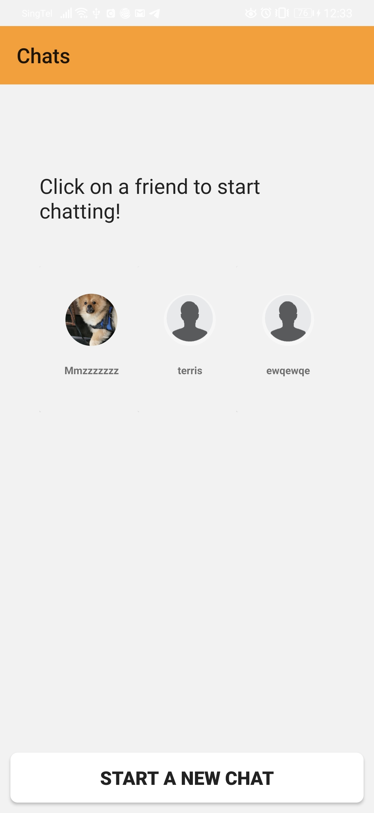

# Social.ly

Team members: Aw Joey(s10196528), Yukie Ang(s10195775), Terris Ng(s10197829), Tan Ming Zhe(S10193694)

Roles and contribution:

Class file
Yukie: ExploreAdapter.java,ExploreFragment.java,

MingZhe: Chat, Conversation, CreateActivity, GridFriendAdapter, Message, MessageAdapter, NewChat, Useradapter

Aw Joey:

Terris:

Layout file

Yukie: 

MingZhe: Activity_conversation.xml, Activity_message, Activity_NewChat.xml, chat_left.xml, chat_right.xml,gridfrienditem.xml,useritem.xml

Aw Joey:

Terris:

Relevant appendices
 

This activity allows the logged in user to see who he has chat with.The button "Start a new chat" allows users to start the NewChat activity.By clicking on a friend, user will be brought to the message activity.
 

This activty will allow users to select a friend to start a conversation. By clicking on a friend the user will be brought to the message activity.

This activity allows user to send a message to a friend and read the message send by this friend.

This activity allows users to create an activity based on the given fields.

